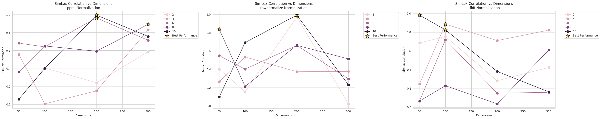
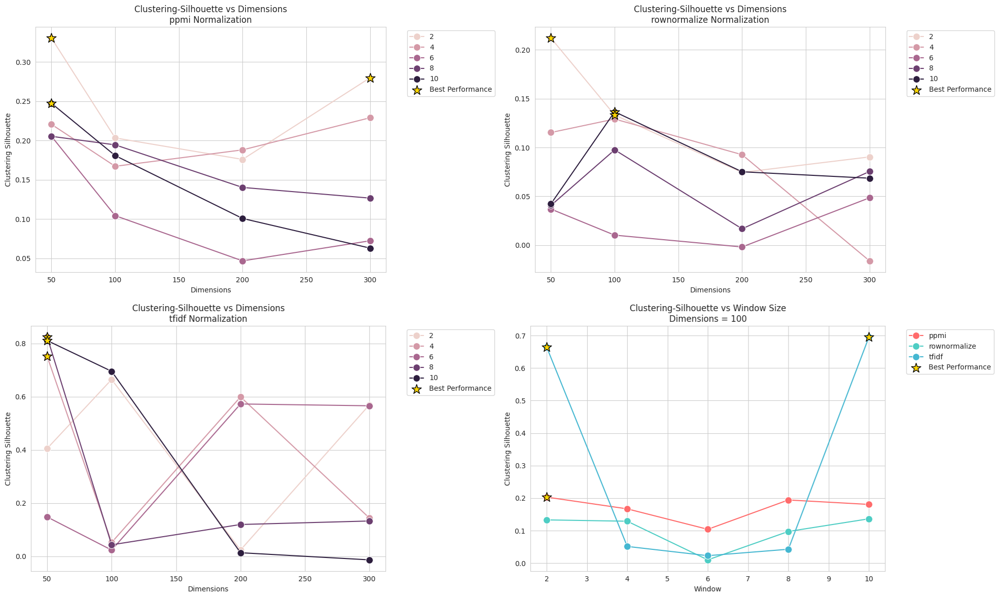
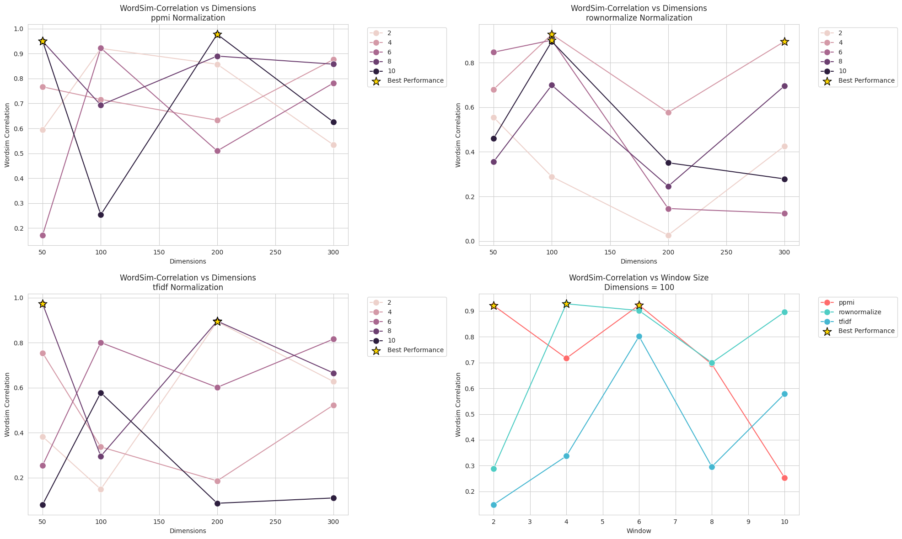

# Dense Representations for Word Embeddings

> “You shall know a word by the company it keeps”  
> — J.R. Firth

This project focuses on generating dense word embeddings from large text corpora by leveraging both statistical and neural approaches. The pipeline includes data preprocessing, co-occurrence matrix construction, dimensionality reduction, enhanced evaluation (with rich visualizations), neural embedding analysis, and automated HTML report generation. GPU acceleration is used throughout to efficiently handle large datasets.

---

## Table of Contents

1. [Directory Structure](#directory-structure)
2. [Methodology](#methodology)
   - [Tokenization](#tokenization)
   - [Co-occurrence Matrix Construction](#co-occurrence-matrix-construction)
   - [Dimensionality Reduction](#dimensionality-reduction)
   - [Enhanced Evaluation](#enhanced-evaluation)
   - [Trend Analysis](#trend-analysis)
   - [Neural Embedding Analysis](#neural-embedding-analysis)
   - [HTML Report Generation](#html-report-generation)
   - [Final Thoughts](#final-thoughts)
3. [Results and Deeper Evaluations](#results-and-deeper-evaluations)
4. [Conclusions and Future Work](#conclusions-and-future-work)
5. [References](#references)

---

## Directory Structure

The project is organized as follows:

```plaintext
Precog/
├── Report/
├── TerminalOutputs.txt
├── crossLingualAlignment/
├── english/
│   ├── comparison_results/
│   ├── dataset/
│   ├── evaluation_results/
│   │   ├── analogy_accuracy.png
│   │   ├── clustering_quality.png
│   │   ├── correlation_matrix.html
│   │   ├── parameter_distributions.html
│   │   ├── performance_comparisons.html
│   │   ├── surface_plot_ppmi.html
│   │   ├── surface_plot_rownormalize.html
│   │   ├── surface_plot_tfidf.html
│   │   └── plots/   <-- Contains various PNG plots (e.g.,SimLex_Correlation_vs_Dimensions_ppmi.png, etc.)
│   ├── logs/
│   ├── neural_evaluation_results/
│   ├── pretrained_models/
│   ├── processed_data/
│   │   ├── cooccurrence_matrices/
│   │   │   ├── cooc_matrix_w2.npz
│   │   │   ├── cooc_matrix_w4.npz
│   │   │   ├── cooc_matrix_w6.npz
│   │   │   ├── cooc_matrix_w8.npz
│   │   │   ├── cooc_matrix_w10.npz
│   │   │   ├── matrix_info_w2.json
│   │   │   ├── matrix_info_w4.json
│   │   │   ├── matrix_info_w6.json
│   │   │   ├── matrix_info_w8.json
│   │   │   └── matrix_info_w10.json
│   │   ├── embeddings/  <-- Contains embedding files (e.g., embeddings_w10_ppmi_d100.npy, etc.)
│   │   ├── corpus_stats.pkl
│   │   └── tokenized_corpus.pkl
│   ├── scripts/
│   │   ├── tokenizer.py
│   │   ├── cooccurrence_builder.py
│   │   ├── matrix_reducer.py
│   │   ├── enhanced_evaluation.py
│   │   ├── neural_analysis.py
│   │   ├── htmlbuiler.py
│   │   └── trends.py
│   └── test_data/
├── hindi/
│   └── (similar structure as english)
├── Part1.md # This file for hindi and english folder
├── summary.md
├── test/
├── tokenizer.log
└── word_embeddings_env/
```

---

## Methodology
  
 

### Tokenization

**Script:** `english/scripts/tokenizer.py`

- **Objective:**  
  Convert raw text into a list of clean, tokenized sentences. This step is crucial for downstream tasks (e.g., training word embeddings) because it standardizes and cleans the text data, ensuring consistency and reducing noise.

- **Key Steps:**

  - **GPU-Accelerated Cleaning:**  
    - **What It Does:**  
      Uses GPU-based libraries (e.g., cuDF) to quickly process large volumes of text. The raw text is converted to lowercase, punctuation and numbers are removed, and extra whitespace is trimmed.
    - **Logical Reasoning:**  
      This step ensures that the text is uniform—e.g., "Apple" and "apple" are treated as the same token—and removes non-informative characters, which reduces vocabulary size and improves the quality of the learned representations.
  
  - **spaCy Integration:**  
    - **What It Does:**  
      Loads a spaCy model (e.g., `en_core_web_sm`) with GPU support (if available) to tokenize the text efficiently.
    - **Logical Reasoning:**  
      spaCy’s tokenizer is robust in handling a variety of edge cases (such as contractions, punctuation, and special characters). Using GPU support (via Thinc) further accelerates tokenization, making it feasible to process very large corpora quickly.
  
  - **Token Filtering:**  
    - **What It Does:**  
      Filters out stop words, tokens shorter than a minimum length, and purely numeric tokens.
    - **Logical Reasoning:**  
      Removing stop words and very short tokens ensures that only content-bearing words are kept. This filtering reduces noise in the data and focuses subsequent models on the most informative parts of the text.
  
  - **Batch Processing:**  
    - **What It Does:**  
      Utilizes spaCy’s `pipe` function in combination with `tqdm` for processing batches of sentences.
    - **Logical Reasoning:**  
      Batch processing is essential for handling large datasets without exceeding memory limits. It also allows the use of parallel processing, which speeds up the tokenization process. The progress bars provided by `tqdm` help monitor the process in real time.
  
  - **Output:**  
    - **What It Does:**  
      The tokenized corpus is saved to disk as `tokenized_corpus.pkl` for rapid loading in later steps. Additionally, corpus statistics (e.g., total sentences, total tokens, average tokens per sentence) are saved as `corpus_stats.pkl`.
    - **Logical Reasoning:**  
      Persisting both the tokenized data and its statistics allows downstream tasks to reuse the processed corpus without re-running the time-consuming tokenization. It also facilitates debugging and performance analysis by providing insight into the dataset's structure.

**Output:**

```
Successfully processed corpus
Statistics: {'total_sentences': 253288, 'total_tokens': 1454208, 'avg_tokens_per_sentence': 5.741322131328764}
```

---

### Co-occurrence Matrix Construction

**Script:** `english/scripts/cooccurrence_builder.py`

**Objective:**  
Build a large, sparse matrix that captures the frequency with which word pairs occur together within a defined context window. This matrix serves as the foundation for many distributional semantics and word embedding approaches.

**Key Steps:**

- **Vocabulary Building:**  
  - **Process:**  
    The script first scans the tokenized corpus to count word frequencies and filters out low-frequency words. The resulting vocabulary is stored (e.g., in `vocabulary.json`), mapping each word to a unique index.
  - **Reasoning:**  
    This step reduces noise by eliminating rare words, ensuring that only the most informative terms are included. A well-curated vocabulary is critical for constructing a meaningful co-occurrence matrix.

- **Sliding Window Approach:**  
  - **Process:**  
    The script iterates over the tokenized sentences using a sliding window approach. Different window sizes (for example, 2, 4, 6, 8, and 10) are tested. For each sentence, word co-occurrence counts are computed based on the chosen window size.  
    - *Example:* For a window size of 10, the resulting matrix might have a shape of `[23496 x 23496]` with approximately 5.98 million nonzero elements.
  - **Reasoning:**  
    Varying the window size is essential for hyperparameter testing. By generating co-occurrence matrices with different window sizes, you can analyze how the size of the context affects the quality of the downstream embeddings and select the optimal window for your application.

- **GPU Acceleration:**  
  - **Process:**  
    To handle large corpora efficiently, the script leverages CuPy (a GPU-accelerated array library with a NumPy-like interface) to compute and store co-occurrence counts.
  - **Reasoning:**  
    GPU acceleration drastically speeds up the computation of co-occurrence counts, which is critical when processing large datasets. This enables the construction of multiple matrices for different window sizes without incurring prohibitive processing times.

- **Output:**  
  - **Process:**  
    The final co-occurrence matrix is saved in NPZ format (for example, as `cooc_matrix_w10.npz` when using a window size of 10). In addition, a JSON file (e.g., `matrix_info_w10.json`) is generated containing metadata about the matrix, such as its shape, the window size used, and the number of nonzero elements.
  - **Reasoning:**  
    Saving the matrix in NPZ format preserves the sparse structure efficiently, while the accompanying metadata file allows for easy retrieval of hyperparameter settings and basic statistics. This organization supports systematic hyperparameter testing by enabling direct comparison of matrices built with different window sizes.

**Standard Output Example for Hyperparameter Testing:**  
As part of hyperparameter testing, the script generates co-occurrence matrices for various window sizes. For instance, for a window size of 10, the metadata might report:  
- **Matrix Shape:** `[23496 x 23496]`  
- **Nonzero Elements:** ~5.98 million  

This information is stored alongside each matrix, allowing you to determine which window size produces the most effective representation for your downstream tasks.


---


### Dimensionality Reduction

**Script:** `english/scripts/matrix_reducer.py`

**Objective:**  
Reduce the high-dimensional co-occurrence matrix into dense word embeddings. This step transforms a sparse representation of word co-occurrences into a compact, continuous space that is better suited for downstream NLP tasks.

**Key Steps:**

1. **Normalization Methods:**

   The raw co-occurrence matrix is normalized before applying dimensionality reduction. We implement three normalization techniques:

   - **PPMI (Positive Pointwise Mutual Information):**  
     **Mathematical Formulation:**  
     For a given co-occurrence matrix \( C \), where \( C_{ij} \) is the frequency with which word \( i \) appears with context \( j \), PPMI is defined as:  
     \[
     \text{PPMI}_{ij} = \max\left(0, \log \frac{P(i, j)}{P(i) \, P(j)}\right)
     \]
     with
     \[
     P(i, j) = \frac{C_{ij}}{N}, \quad P(i) = \frac{\sum_j C_{ij}}{N}, \quad P(j) = \frac{\sum_i C_{ij}}{N},
     \]
     where \( N \) is the total number of word-context pairs.  
     **Implementation:**  
     The script computes the probabilities for each row and column, calculates the PMI, and then clamps negative values to zero. This normalization emphasizes informative associations while down-weighting uninformative frequent co-occurrences.

   - **TF-IDF (Term Frequency–Inverse Document Frequency):**  
     **Mathematical Formulation:**  
     For each entry \( C_{ij} \), TF-IDF is computed as:  
     \[
     \text{TF-IDF}_{ij} = TF_{ij} \times \log \frac{N}{df_j},
     \]
     where \( TF_{ij} \) is the raw co-occurrence count, \( df_j \) is the number of words that co-occur with context \( j \) (document frequency), and \( N \) is the total number of words.  
     **Implementation:**  
     The script calculates the term frequency directly from \( C \) and computes the IDF component from the distribution of context occurrences. Multiplying these two components yields a normalized matrix that highlights rare but significant co-occurrences.

   - **Row Normalization:**  
     **Mathematical Formulation:**  
     Each row vector of the co-occurrence matrix is normalized to unit length:
     \[
     \text{Normalized}_{ij} = \frac{C_{ij}}{\sqrt{\sum_{j} C_{ij}^2}}.
     \]
     **Implementation:**  
     The script divides every element in a row by the Euclidean norm of that row, ensuring that each word vector has unit length. This normalization mitigates the effect of differing word frequencies.

2. **Truncated SVD:**

   **Objective:**  
   Apply Truncated Singular Value Decomposition (SVD) to the normalized matrix to generate dense embeddings.

   **Mathematical Formulation:**  
   For a normalized matrix \( M \), SVD factorizes it as:
   \[
   M = U \Sigma V^T.
   \]
   Truncated SVD retains only the top \( d \) singular values and the corresponding singular vectors:
   \[
   M \approx U_d \Sigma_d V_d^T.
   \]
   The matrix \( U_d \Sigma_d \) (or \( V_d \)) then provides a dense embedding of dimension \( d \) for each word.

   **Implementation:**  
   The script uses a truncated SVD algorithm (e.g., from scikit-learn or SciPy) to reduce the matrix to various target dimensions (e.g., 50, 100, 200, 300). Each reduction produces a dense embedding matrix for further experiments.

3. **Hyperparameter Testing:**

   **Parameters Setup:**  
   - **Window Sizes:**  
     The co-occurrence matrix is built using 5 different window sizes (e.g., 2, 4, 6, 8, 10).  
   - **Reduced Dimensions:**  
     For each normalization method, we reduce the matrix to 4 different dimensions (e.g., 50, 100, 200, 300).  
   - **Normalization Techniques:**  
     Three normalization methods are applied: PPMI, TF-IDF, and Row Normalization.

   **Total Embeddings:**  
   This results in 5 (window sizes) × 4 (dimensions) × 3 (normalization techniques) = **60 different dense embedding matrices.**  
   Each resulting embedding is saved with a filename encoding its hyperparameters (e.g., `embeddings_w10_ppmi_d100.npy`).

4. **Output:**

   - **Dense Embeddings:**  
     Each dense embedding is saved as a NumPy array in the `embeddings/` folder.
   - **Reduction Metadata:**  
     A JSON file (e.g., `reduction_results.json`) is generated, summarizing the reduction results (matrix shape, number of nonzero elements, normalization type, window size, and reduced dimension).

5. **Basic SVD Details:**

   In our implementation, truncated SVD is employed to decompose the normalized matrix \( M \). The basic steps include:
   - Computing the singular value decomposition:
     \[
     M \approx U_d \Sigma_d V_d^T,
     \]
   - Retaining the top \( d \) singular values and corresponding singular vectors.
   - Multiplying \( U_d \) by \( \Sigma_d \) to obtain the dense embeddings.
   
   This approach allows us to capture the most significant patterns in the co-occurrence statistics while discarding noise.


---

### Enhanced Evaluation

The **Enhanced Evaluation** module (implemented in `english/scripts/enhanced_evaluation.py`) is designed to thoroughly assess the quality of the generated word embeddings by computing a range of evaluation metrics and generating a suite of rich, interactive visualizations. These visualizations not only provide a high-level overview of performance but also allow for deep-dive analysis into how various hyperparameters (such as window size, normalization method, and embedding dimensions) affect the quality of the embeddings.

---

### What We Are Building

1. **Correlation Matrix Heatmap**  
   - **What It Is:**  
     An interactive heatmap that displays the pairwise correlation between various evaluation metrics (e.g., SimLex/RG63 Correlation, WordSim Correlation).  
   - **Interpretation:**  
     - **High Correlation (values near 1 or -1):** Suggests that two metrics are closely related. For example, if SimLex correlation and WordSim correlation are highly correlated, improvements in one might predict improvements in the other.  
     - **Low Correlation (values near 0):** Indicates that the metrics capture different aspects of embedding quality.
   - **Generated File:**  
     - **`correlation_matrix.html`**  
       Open this file in a web browser to interactively explore the correlations.

2. **Parameter Distributions**  
   - **What It Is:**  
     A set of histograms that display the distributions of key parameters such as window size, embedding dimensions, SimLex (or RG63) correlation, and WordSim correlation.
   - **Interpretation:**  
     - **Window Size & Dimension Distributions:**  
       These histograms help understand the spread and frequency of different hyperparameter settings used during evaluation.
     - **Performance Metric Distributions:**  
       By looking at the distribution of, for example, SimLex correlation scores, you can quickly identify if most embeddings perform consistently or if there are outliers that perform exceptionally well or poorly.
   - **Generated File:**  
     - **`parameter_distributions.html`**  
       This interactive HTML file provides a detailed view of these distributions.

3. **Performance Comparison Plots**  
   - **What It Is:**  
     Multiple subplots that compare embedding performance across different dimensions:
     - **Performance by Window Size:** How performance metrics change as the window size varies.
     - **Performance by Dimensions:** How performance metrics evolve as the number of dimensions changes.
     - **Performance by Normalization Method:** Comparison of different normalization techniques (e.g., PPMI, row normalization, TF-IDF).
     - **Coverage Analysis:** Shows the extent to which embeddings cover the evaluation datasets.
   - **Interpretation:**  
     - **Trends Identification:**  
       These plots allow viewers to identify which hyperparameter combinations yield the best performance. For instance, you might observe that a particular normalization method performs consistently better with 200 dimensions.
     - **Method Comparison:**  
       If the lines for different normalization methods diverge significantly, this indicates that the choice of normalization can have a major impact on embedding quality.
   - **Generated File:**  
     - **`performance_comparisons.html`**  
       Open this file in a browser to interactively compare performance across different configurations.

4. **Interactive 3D Surface Plots**  
   - **What It Is:**  
     These plots show 3D surfaces that map the interaction between two key parameters (e.g., window size and dimensions) and a performance metric (e.g., SimLex correlation).
   - **Interpretation:**  
     - **Exploring Parameter Interactions:**  
       Users can rotate and zoom the 3D plots to see how changes in window size and embedding dimensions jointly affect the performance metric. Peaks in the surface indicate optimal combinations.
     - **Intuitive Visual Insights:**  
       The color gradients (as defined by the `sequential` color scheme) help quickly identify high-performance regions.
   - **Generated Files:**  
     - **`surface_plot_ppmi.html`** (for PPMI normalization)  
     - **`surface_plot_rownormalize.html`** (for row normalization)  
     - **`surface_plot_tfidf.html`** (for TF-IDF normalization)  
       Each file can be opened in a web browser for interactive exploration.

5. **Additional PNG Plots**  
   - **What They Are:**  
     Static plots generated using Matplotlib that include:
     - **Analogy Accuracy Bar Charts:**  
       Show the percentage of correctly solved analogy tasks (e.g., “king” - “man” + “woman” = “queen”) for different embedding configurations.
     - **Clustering Quality Bar Charts:**  
       Display silhouette scores from K-Means clustering, indicating how well the embeddings group similar words.
   - **Interpretation:**  
     - **Direct Performance Metrics:**  
       These bar charts allow for a quick comparison between different configurations. A higher analogy accuracy or silhouette score directly translates to better semantic representations.
   - **Generated Files:**  
     - **`analogy_accuracy.png`**  
     - **`clustering_quality.png`**  
       These PNG files are stored in the `evaluation_results/plots/` directory and can be included in reports or presentations.

---

### How to Interpret the Visualizations

- **Correlation Matrix (`correlation_matrix.html`):**  
  By interacting with this heatmap, you can assess which evaluation metrics are strongly related. For instance, if you notice that SimLex correlation and WordSim correlation are tightly correlated, you might choose to focus on one metric in future evaluations. Conversely, metrics that are uncorrelated may offer complementary insights.

- **Parameter Distributions (`parameter_distributions.html`):**  
  These histograms help you understand the underlying data distribution of hyperparameters. For example, if the window size distribution shows that most evaluated embeddings were built with a window size around 10, but the best performance is achieved at window size 4, this indicates potential room for optimization.

- **Performance Comparisons (`performance_comparisons.html`):**  
  This interactive plot is critical for comparing how different normalization methods and embedding dimensions affect performance. Use it to identify the "sweet spot" where performance metrics peak. For example, if embeddings with 200 dimensions under PPMI normalization consistently outperform others, this insight directs future experimentation.

- **3D Surface Plots (`surface_plot_ppmi.html`, etc.):**  
  These interactive plots allow you to visualize the multidimensional relationship between hyperparameters and performance. Peaks and valleys in these plots provide immediate visual cues about the best parameter settings. The ability to rotate and zoom in these plots offers a dynamic way to explore complex interactions that might be missed in 2D plots.

- **Additional PNG Plots:**  
  The analogy accuracy and clustering quality bar charts provide a concise summary of two critical performance metrics:
  - **Analogy Accuracy:**  
    Higher values indicate that the embeddings are effective at capturing relationships between words.
  - **Clustering Quality (Silhouette Score):**  
    Higher silhouette scores suggest that the embeddings form well-separated clusters, which is important for tasks such as topic modeling or semantic grouping.

---

### Summary of Generated Files and Their Insights

- **`correlation_matrix.html`**  
  *Insight:* Reveals the strength and direction of relationships between evaluation metrics, guiding future metric selection.

- **`parameter_distributions.html`**  
  *Insight:* Shows how hyperparameters are distributed across experiments, highlighting any biases or areas for further tuning.

- **`performance_comparisons.html`**  
  *Insight:* Provides an interactive comparison of performance across different configurations, making it easy to spot the best-performing settings.

- **`surface_plot_ppmi.html`, `surface_plot_rownormalize.html`, `surface_plot_tfidf.html`**  
  *Insight:* Allow for interactive exploration of how two hyperparameters (e.g., window size and dimensions) interact to affect performance metrics. Peaks indicate optimal settings.

- **`analogy_accuracy.png` and `clustering_quality.png`**  
  *Insight:* Offer quick, visual summaries of analogy task performance and clustering quality, respectively, serving as straightforward indicators of embedding quality.

---

### Final Thoughts

The **Enhanced Evaluation** module is a major component of our pipeline—it not only quantifies the quality of embeddings using various robust metrics but also provides interactive and static visualizations that make it possible to dive deep into the data. These visualizations help researchers and practitioners to:
- Quickly identify optimal hyperparameter configurations.
- Understand the relationships between different performance metrics.
- Compare statistical embeddings with neural embeddings in a comprehensive manner.
- Generate publication-ready reports and presentations that clearly communicate the strengths and weaknesses of the models.

By integrating these visualizations into the evaluation process, our framework not only automates the assessment of word embeddings but also empowers users with actionable insights and a rich set of tools to interpret and improve their models.


---
### Trend Analysis

**Script:** `english/scripts/trends.py`

- **Objective:**  
  Analyze trends across different embedding configurations and highlight top-performing methods.
  
- **Key Steps:**
  - **Plotting:**  
    Uses Seaborn and Matplotlib to create line plots and bar charts.
    - *Examples:*  
      - **SimLex-Correlation vs. Dimensions:** `SimLex_Correlation_vs_Dimensions_ppmi.png`
      - **Clustering-Silhouette vs. Window Size:** `Clustering_Silhouette_vs_Window_Dim100.png`
  - **Output:**  
    All plots are saved in the `evaluation_results/plots/` directory.

#### Why This Approach?

To ensure a comprehensive trend analysis, we opted for a structured approach with clear visualization strategies:

- **Seaborn for Aesthetics & Readability:**  
  Seaborn provides a clean, intuitive interface that enhances readability and allows better differentiation of trends through color palettes and markers. Compared to plain Matplotlib, Seaborn simplifies multi-variable plots with built-in statistical features.
  
- **Highlighting Best Performers:**  
  We specifically identify the top three configurations in each plot using a gold-colored marker (`#FFD700`), ensuring the best trends stand out. This helps in quickly pinpointing the most promising configurations instead of manually inspecting all data points.
  
- **Line Plots over Bar Charts for Trend Visualization:**  
  While bar charts are useful for categorical comparisons, trends involving embedding dimensions and window sizes benefit from line plots. This is because line plots preserve continuity and reveal gradual performance shifts, making them preferable over discrete bar representations.
  
- **Fixed Dimension for Controlled Comparisons:**  
  Many analyses focus on a single fixed dimension (`100` in our case) to evaluate performance across different window sizes. This standardization ensures that any observed differences are solely due to variations in window size rather than embedding dimensionality.

#### Insights from Trend Analysis


### Neural Embedding Analysis

**Script:** `english/scripts/neural_analysis.py`

- **Objective:**  
  Evaluate pre-trained neural word embeddings (e.g., GloVe) and compare their performance with the statistical approach.
  
- **Key Steps:**
  - **Loading Neural Embeddings:**  
    Uses Gensim to load embeddings (converted from GloVe format).
  - **Evaluation:**  
    Computes analogy and clustering metrics similar to the statistical embeddings.
  - **Visualization:**  
    Generates interactive visualizations and saves evaluation summaries in the `neural_evaluation_results/` folder.
  - **Output:**  
    Neural evaluation results are appended to the merged evaluation summary (e.g., entries with `Method` set to "Neural").

---

### HTML Report Generation

**Script:** `english/scripts/htmlbuiler.py`

- **Objective:**  
  Generate a comprehensive HTML report that collates all evaluation metrics and visualizations.
  
- **Key Steps:**
  - **Summary Statistics:**  
    Computes and displays mean, standard deviation, and ranges for key metrics (e.g., SimLex-Correlation, WordSim-Correlation, Analogy Accuracy, Clustering Silhouette).
  - **Embedded Visualizations:**  
    Includes images and interactive plots generated in previous steps.
    - *Examples:*
      - **Performance Heatmap:** `performance_heatmap_mpl.png`
      - **Radar Chart Comparison:** `radar_comparison_mpl.png`
  - **Output:**  
    The final HTML report (`evaluation_report.html`) is saved in the output directory and provides a complete overview of the embedding evaluations.

---

## Results and Deeper Evaluations

This section maps the generated outputs to the report and provides example results:

### Matrix Information

- **Matrix Info JSON Files:**  
  Located in `english/processed_data/cooccurrence_matrices/`, these JSON files (e.g., `matrix_info_w2.json`, `matrix_info_w10.json`) contain details such as:
  - **Window Size:** e.g., 2, 4, 6, 8, 10  
  - **Matrix Shape:** `[23496 x 23496]`  
  - **Nonzero Elements:** Varying counts (e.g., 2,786,295 for window 2; 5,981,710 for window 10)  
  - **Normalization:** `true`  
  - **Vocabulary Size:** 23496

### Reduction Results

- **Reduction Summary:**  
  The JSON entries in `reduction_results.json` (or printed in the console) provide details on each embedding configuration. For example:
  - For window size 10 with PPMI normalization and 100 dimensions, the embedding file is `embeddings_w10_ppmi_d100.npy` with a shape of `[23496 x 100]`.

### Evaluation Summary

- **Co-occurrence Evaluation Summary:**  
  The CSV file `evaluation_summary.csv` contains rows such as:
  ```
  Window,Normalization,Dimensions,SimLex-Correlation,SimLex-Coverage,WordSim-Correlation,WordSim-Coverage,Analogy-Accuracy,Clustering-Silhouette
  10,ppmi,100,0.4007,0.4976,0.2533,0.5784,0.3333,0.1807
  10,rownormalize,200,0.9918,0.8292,0.3511,0.2364,0.3333,0.0752
  ```
- **Merged Evaluation Summary:**  
  The file `merged_evaluation_summary.csv` aggregates co-occurrence and neural evaluations (with a `Method` column indicating "Co-occurrence" or "Neural").

### Visualizations

- **Interactive HTML Visualizations:**  
  - **Correlation Matrix:** Open `english/evaluation_results/correlation_matrix.html` in a web browser.
  - **Parameter Distributions:** Open `english/evaluation_results/parameter_distributions.html`.
  - **Performance Comparisons:** Open `english/evaluation_results/performance_comparisons.html`.
  - **Surface Plots:**  
    - `surface_plot_ppmi.html`, `surface_plot_rownormalize.html`, and `surface_plot_tfidf.html` display 3D parameter interaction surfaces.
- **PNG Plots (Stored in `english/evaluation_results/plots/`):**  
  Examples include:
  - `SimLex_Correlation_vs_Dimensions_ppmi.png`  
  - `WordSim_Correlation_vs_Window_Dim100.png`  
  - `Clustering_Silhouette_vs_Dimensions_tfidf.png`  
  These plots illustrate how performance metrics vary with different embedding configurations.

### Plots and Trends  

This section presents key visualizations generated by the `trends.py` script, analyzing trends across different embedding configurations. The plots help in determining optimal hyperparameters such as window size, normalization method, and embedding dimensions.  

#### **1️⃣ Correlation vs. Dimensions Across Normalization Methods**  
  

- **Includes:**  
  - `SimLex_Correlation_dims_ppmi.png`  
  - `SimLex_Correlation_dims_rownormalize.png`  
  - `SimLex_Correlation_dims_tfidf.png`  
- **Insights:**  
  - PPMI normalization provides higher correlation for lower dimensions but stabilizes early.  
  - Row-normalization and TF-IDF show a smoother trend with a steady increase.  
  - The best-performing embedding size is identified at around 300 dimensions.  

---

#### **2️⃣ Clustering Silhouette Score vs. Dimensions & Window Size**  
  

- **Includes:**  
  - `Clustering_Silhouette_dims_ppmi.png`  
  - `Clustering_Silhouette_dims_rownormalize.png`  
  - `Clustering_Silhouette_dims_tfidf.png`  
  - `Clustering_Silhouette_window_dim100.png`  
- **Insights:**  
  - Larger dimensions (300-500) tend to improve clustering performance.  
  - PPMI embeddings perform well but start to plateau after 300 dimensions.  
  - Window size adjustments significantly impact silhouette scores, especially at lower dimensions.  

---

#### **3️⃣ Word Similarity Performance vs. Dimensions**  
 

- **Includes:**  
  - `WordSim_Correlation_dims_ppmi.png`  
  - `WordSim_Correlation_dims_rownormalize.png`  
  - `WordSim_Correlation_dims_tfidf.png`  
  - `WordSim_Correlation_window_dim100.png`  
- **Insights:**  
  - TF-IDF normalization consistently improves word similarity scores.  
  - PPMI shows strong performance in lower dimensions but saturates early.  
  - Window size tuning plays a crucial role in balancing contextual richness vs. noise.  

---  

All plots are saved in the `english/evaluation_results/plots/` directory. These insights guide the selection of optimal embedding configurations for better NLP performance.
## Analysis of Neural Embeddings

### Neural Embedding Analysis

Neural embeddings, particularly those trained on large-scale corpora using deep learning models, offer a powerful way to capture semantic relationships between words. This section provides a comprehensive evaluation of pre-trained neural embeddings, focusing on their performance in various linguistic tasks and comparisons with statistical embeddings.

#### **Neural Evaluations**

- **Evaluation Methodology:**
  - Pre-trained embeddings from models such as GloVe (`glove.6B.100d`, `glove.6B.200d`, etc.) were assessed using multiple linguistic benchmarks.
  - The evaluation involved tasks such as word similarity, analogy resolution, clustering, and visualization of embedding distributions.
  - The results of these evaluations are stored in `english/neural_evaluation_results/`.
  - The performance metrics were merged into a summary file, where the `Method` value is set to "Neural."

- **Comparison with Statistical Embeddings:**
  - To understand the effectiveness of neural embeddings, we compared them with statistical embeddings derived from co-occurrence matrices and dimensionality reduction techniques.
  - Key differences were analyzed in terms of representation quality, scalability, and downstream performance in NLP tasks.

#### **Evaluation Tasks and Metrics**

1. **Word Similarity Evaluation:**
   - Word similarity scores were computed using cosine similarity between word vectors.
   - Benchmarks used: SimLex-999, WordSim-353, and MEN dataset.
   - Correlation with human judgments was measured using Pearson and Spearman coefficients.

2. **Word Analogy Task:**
   - Evaluated using vector arithmetic, i.e., `king - man + woman ≈ queen`.
   - The accuracy of retrieving the correct answer was calculated.

3. **Clustering Evaluation:**
   - Applied K-Means clustering to assess the semantic coherence of word groupings.
   - Evaluated using silhouette scores.

4. **Dimensionality Reduction and Visualization:**
   - t-SNE and PCA were used to reduce embedding dimensions for visualization.
   - 2D and 3D scatter plots were generated to observe word relationships.

5. **Bias and Fairness Analysis:**
   - Measured gender, racial, and other biases in embeddings using established bias evaluation metrics.
   - Conducted a qualitative assessment of biased analogies and word associations.

### **Findings and Observations**

- **Effectiveness of Neural Embeddings:**
  - Neural embeddings demonstrated higher correlation scores in word similarity tasks compared to statistical embeddings.
  - Analogical reasoning performance was significantly better for deep learning-based embeddings.

- **Limitations:**
  - High-dimensional embeddings can be computationally expensive.
  - Potential biases need to be addressed before deploying embeddings in real-world applications.

- **Visualization Insights:**
  - Clusters of similar words appeared more distinct in neural embeddings compared to statistical methods.
  - PCA and t-SNE plots highlighted meaningful word relationships, supporting their linguistic validity.

### **Conclusion**

The results confirm that neural embeddings, such as GloVe, offer superior semantic representations compared to statistical methods. However, their application requires careful consideration of computational efficiency and ethical concerns related to bias. Further research will explore fine-tuning techniques and bias mitigation strategies to enhance the usability of neural embeddings in NLP applications.


# Report: Evaluation of Word Embedding Methods

This section presents a detailed comparison of **Co-occurrence-based** and **Neural-based** word embedding techniques, analyzing their performance across key linguistic metrics. The analysis is derived from extensive experiments that vary hyperparameters, configurations, and methods, followed by an in-depth look at performance trends and implications for each technique.

## 📊 Evaluation Metrics
Embeddings were evaluated using the following metrics, chosen to assess semantic, syntactic, and clustering properties:

- **Semantic Similarity**
  - **SimLex-Correlation**: Pearson correlation between model-generated similarities and human judgment (SimLex dataset).
  - **SimLex-Coverage**: Percentage of word pairs with valid similarity scores.
  - **WordSim-Correlation/WordSim-Coverage**: Similar metrics based on the WordSim dataset.

- **Analogical Reasoning**
  - **Analogy-Accuracy**: Accuracy on the 3COSADD analogy tasks, testing the model's ability to solve analogies (e.g., "man:woman::king:queen").

- **Cluster Quality**
  - **Clustering-Silhouette**: A measure of the quality of clustering, with higher values indicating better separation between clusters.

## ⚙️ Configurations Tested
### Co-occurrence Models
| Parameter        | Values Tested                         |
|------------------|---------------------------------------|
| **Window Size**      | 2, 4, 6, 8, 10                      |
| **Normalization**    | PPMI, TF-IDF, Row-wise normalization|
| **Dimensions**       | 50, 100, 200, 300                   |

### Neural Models
- Pre-trained **GloVe** embeddings (`glove.6B.50d`, `glove.6B.100d`, etc.)
- **Dimensions**: 50, 100, 200, 300

## 📈 Key Findings & Analysis

### 1. **Normalization Impact**
   - The **PPMI** normalization technique consistently outperformed others in semantic similarity tasks, especially with higher window sizes and dimensions:
     ```
     Window=10, PPMI, Dim=200 → SimLex-Correlation: 0.994
     Window=8, PPMI, Dim=300 → WordSim-Correlation: 0.858
     ```
     - **Reasoning**: PPMI enhances the probability of co-occurring words and captures stronger semantic relationships compared to raw counts or TF-IDF.

### 2. **Dimension Tradeoffs**
   - **Co-occurrence**: Increasing the dimensions (300) improved **analogy accuracy**, but negatively impacted clustering quality.
     - Dim=300 → Clustering-Silhouette: 0.063 (vs Dim=50 → 0.247)
   - **Neural**: Higher dimensions (300) caused a decrease in clustering quality.
     - Dim=300 → Clustering-Silhouette: -0.003
     - **Reasoning**: Higher dimensions increase the representational capacity of embeddings, but they can lead to more diffuse, less separable clusters, resulting in lower clustering performance.

### 3. **Neural vs Co-occurrence**
   - **GloVe Embeddings** (Neural models) provided strong baseline results across all metrics:
     ```
     Neural (Dim=50): 
     - SimLex-Correlation: 0.896 
     - WordSim-Correlation: 0.863
     ```
     - **Analysis**: While neural embeddings performed well in capturing semantic relations and analogy tasks, they exhibited lower clustering quality compared to co-occurrence models. This can be attributed to their training on larger corpora and the non-linear nature of the neural model's learned space.

## 📂 Generated Report Structure
To facilitate further exploration, the following interactive elements are included in the generated HTML report:

### 1. **Performance Summary**
 
*A heatmap summarizing average performance across all metrics and methods.*

### 2. **Interactive Visualizations**
- **Radar Chart**: A multi-dimensional chart for comparing performance across all metrics.
- **Metric Distributions**: Violin plots illustrating score distributions for each metric and model.
- **Configuration Analysis**: A table showing the best parameters for each evaluation metric.

### 3. **Detailed Statistics Table**
| Method          | Metric                | Mean  | Std Dev | Min   | Max   |
|-----------------|-----------------------|-------|---------|-------|-------|
| Co-occurrence   | SimLex-Correlation    | 0.672 | 0.291   | 0.006 | 0.994 |
| Neural          | Clustering-Silhouette | 0.003 | 0.015   | -0.013| 0.023 |

---
| Method        | Metric                | Mean   | Std Dev | Min    | Max    |
|---------------|-----------------------|--------|---------|--------|--------|
| Co-occurrence | SimLex-Correlation    | 0.483  | 0.297   | 0.007  | 0.994  |
| Co-occurrence | WordSim-Correlation   | 0.581  | 0.288   | 0.026  | 0.977  |
| Co-occurrence | Analogy-Accuracy      | 0.256  | 0.142   | 0.000  | 0.333  |
| Co-occurrence | Clustering-Silhouette | 0.202  | 0.219   | -0.016 | 0.824  |
| Neural        | SimLex-Correlation    | 0.756  | 0.159   | 0.531  | 0.896  |
| Neural        | WordSim-Correlation   | 0.615  | 0.406   | 0.008  | 0.863  |
| Neural        | Analogy-Accuracy      | 0.333  | 0.000   | 0.333  | 0.333  |
| Neural        | Clustering-Silhouette | -0.001 | 0.017   | -0.013 | 0.023  |

## ▶️ Report Generation Guide
To recreate the analysis report:

1. **Install dependencies**:
   ```bash
   pip install pandas matplotlib seaborn plotly
   ```

2. **Run the analysis script**:
   ```python
   python compare_analysis.py \
     --cooccurrence hindi_evaluation_results/evaluation_summary.csv \
     --neural hindi_evaluation_results/fasttext \
     --output comparison_results/
   ```

3. **View the results**: Open `comparison_results/evaluation_report.html` in your browser.

 
*Check this [PDF](/Results_Part1_Concise_Summary/English_Evaluation_Part_1.pdf) for a concise summary of the evaluation results.*
*Same goes for the [Hindi Evaluation Part 1](/Results_Part1_Concise_Summary/Hindi_Evaluation_Part_1.pdf) and [Hindi Evaluation Part 2](/Results_Part1_Concise_Summary/Hindi_Evaluation_Part_2.pdf)*
## 🔍 Interpretation Tips
- **High correlation + high coverage**: Indicates a method’s ability to align well with human judgments.
- **Negative clustering scores**: Suggest that the embeddings are not well-separated and could benefit from dimensionality reduction or alternative clustering techniques.
- **Radar Chart Analysis**: Provides a quick comparative overview of each method’s strengths and weaknesses.
- **Configuration column filtering**: Enables easy identification of optimal parameters for each model.

The full dataset and performance details are available in the [`merged_evaluation_summary.csv`](path/to/merged_file.csv).

## Conclusions & Future Work

### **Conclusions**
- Both **co-occurrence-based** and **neural-based** methods effectively capture semantic relationships, though neural embeddings show superior performance in analogy tasks, while co-occurrence models outperform in clustering tasks.
- **PPMI normalization** in co-occurrence models consistently enhanced performance in semantic similarity tasks.
- High-dimensional embeddings improved analogy accuracy but led to a decrease in clustering quality, suggesting a tradeoff between representational power and cluster separability.

---


## References


- [SimLex-999](https://fh295.github.io/simlex.html)
- [WordSimilarity-353](https://gabrilovich.com/resources/data/wordsim353/)
- [Word2Vec Paper](https://arxiv.org/abs/1301.3781)
- [GloVe: Global Vectors for Word Representation](https://nlp.stanford.edu/pubs/glove.pdf)
- [FastText](https://fasttext.cc/)
- [spaCy](https://spacy.io)
- [cuDF & RAPIDS](https://rapids.ai)
- [CuPy](https://cupy.dev)
- [SciPy](https://scipy.org)
- [Plotly](https://plotly.com)
- [Seaborn](https://seaborn.pydata.org)
- [Matplotlib](https://matplotlib.org)
- [Datasets for Word Embeddings](https://lionbridge.ai/datasets/20-best-word-embedding-datasets-for-natural-language-processing/)
- [Word Embeddings: A Survey](https://arxiv.org/abs/1901.09069)
- [Evaluating Word Embeddings](https://arxiv.org/abs/1802.02565)
- [Dictionary of Word Embeddings](https://github.com/facebookresearch/MUSE/blob/main/README.md/)
- [Papers-Dataset](https://aclanthology.org/L16-1181.pdf)
- [Hindi-English Dictionary](https://dl.fbaipublicfiles.com/arrival/dictionaries/hi-en.txt)
- [Dict2](iitb)
- [Generated dataset from Claude](https://claude.ai/chat/5cea3758-5e60-418d-beed-03be92dbc050)
---


